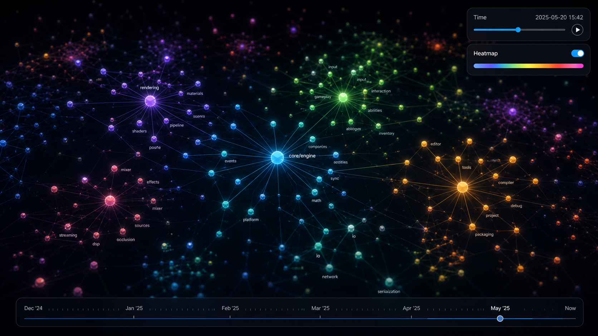
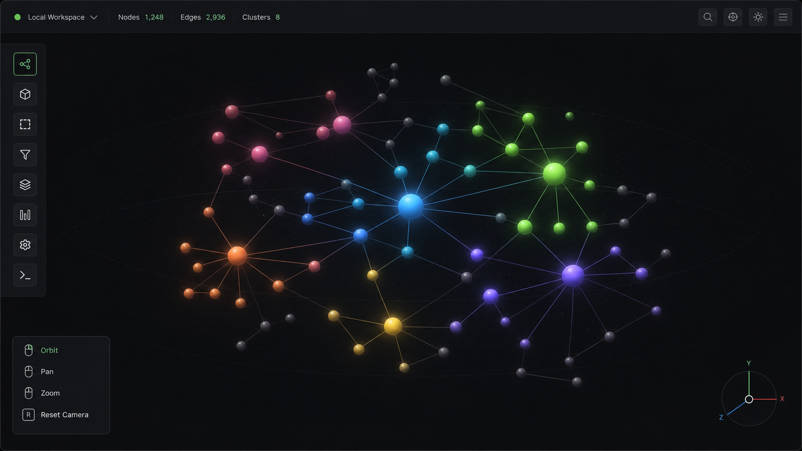
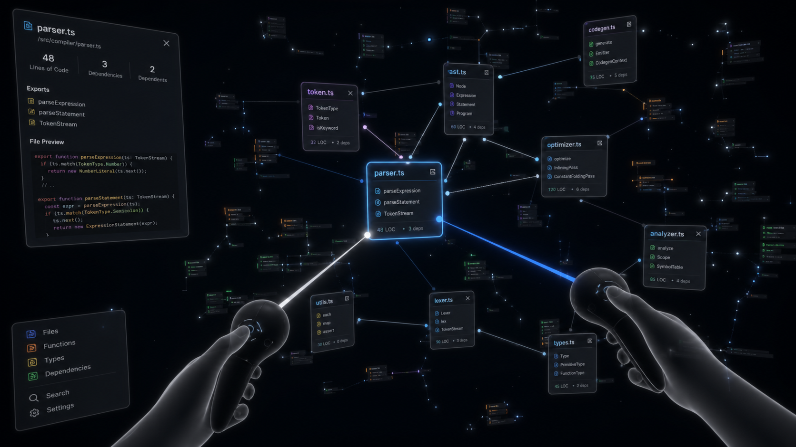
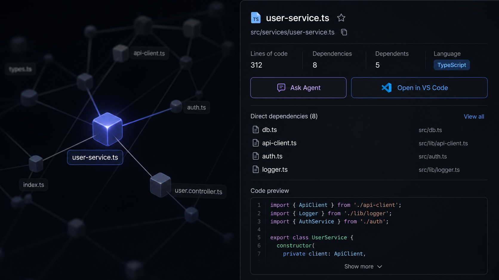
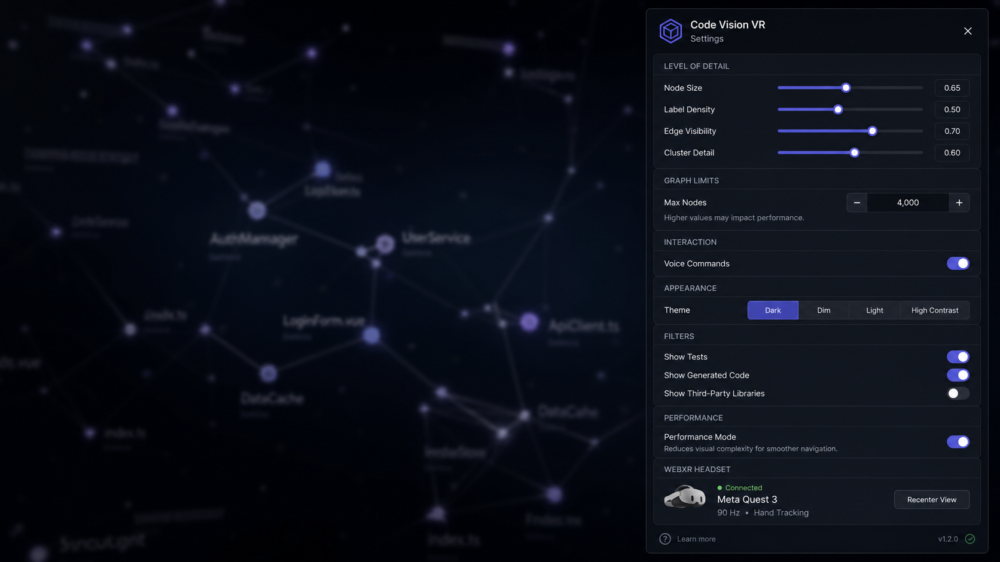
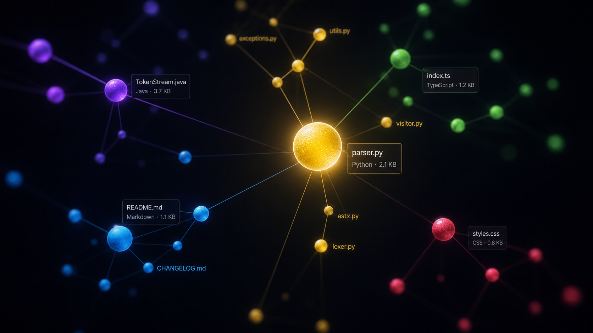
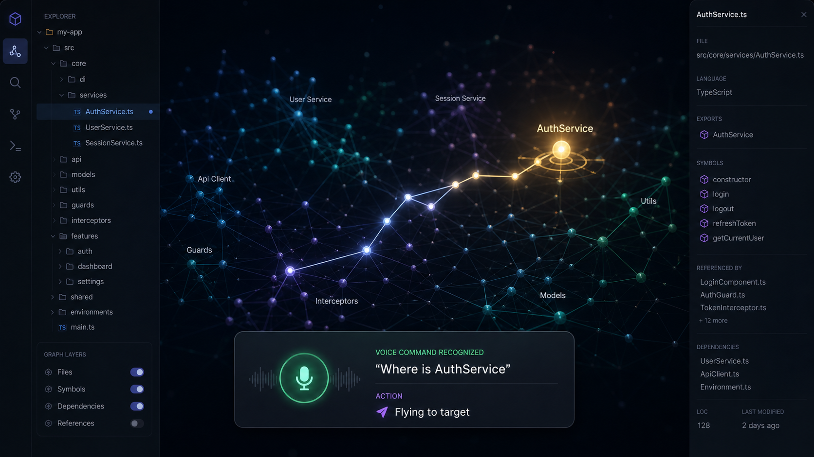
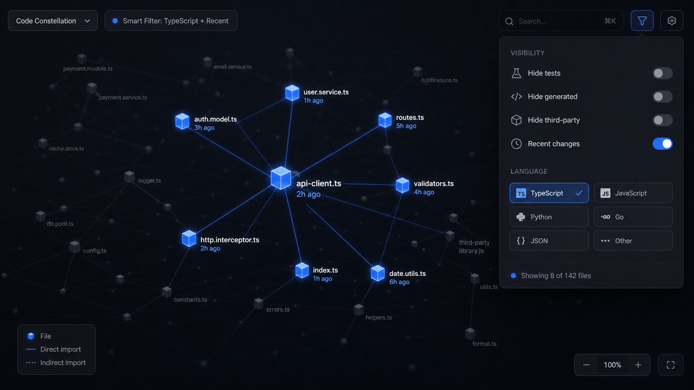
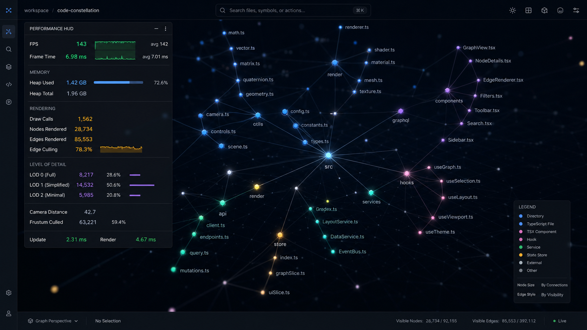

# Holocron VR

<!-- ASCII art logo -->

```
╔══════════════════════════════════════════════════╗
║                  HOLOCRON VR                      ║
║     Explore your codebase in immersive 3D VR      ║
╚════════════════════════════════════════════════════╝
```

[](https://github.com/Yoda-Man/Holocron/releases)
[](https://github.com/Yoda-Man/Holocron/actions/workflows/ci.yml)
[](https://github.com/Yoda-Man/Holocron/actions/workflows/release.yml)
[](LICENSE)
[](CONTRIBUTING.md)
[](#testing)
[](https://yodaman.dev)

**Turn your codebase into an explorable 3D VR constellation.** Holocron VR transforms YodaMan's Graphify knowledge graphs into a navigable 3D universe where every file is a glowing sphere, every dependency is a connecting line, and you can fly through it all with mouse, keyboard, or a Meta Quest headset.



---

## Screenshots

| Desktop 3D | VR Mode | Info Panel | Settings |
|---|---|---|---|
|  |  |  |  |
| Full 3D viewport with mouse/keyboard controls. | Immersive VR experience with hand-tracked controllers. | Detailed file info with interactive action buttons. | Configurable LOD, filters, voice, and theme. |

| Node Detail | Voice Command | Filtering | Performance HUD |
|---|---|---|---|
|  |  |  |  |
| Spheres sized by LOC, coloured by language, glowing by importance. | "Where is AuthService" instantly flies to the target. | Hide tests, third-party code, or show only recent changes. | Press Ctrl+Shift+D to reveal live performance metrics. |

---

## Features

### 🎮 Desktop 3D & VR
- **Desktop mode** — Mouse/keyboard orbit, pan, zoom, and click interaction
- **VR mode** — Meta Quest 2/3/Pro via WebXR with full 6-DoF controller tracking
- **Single InstancedMesh** — All 3,000+ nodes rendered in a single draw call
- **SIMD-accelerated WASM** — Layout computation 10× faster than pure JS (52 `wasm_simd128.h` intrinsics)
- **LOD system** — 4-tier Level of Detail (FULL→MID→DOT→CULLED) with hysteresis anti-flicker
- **10-frame transition animation** — Smooth interpolated scale changes between LOD tiers
- **Auto-performance mode** — Automatically reduces LOD thresholds when FPS < 45 for 3+ seconds
- **Edge visual encoding** — 4 edge types with distinct colours (white=import, orange=call, purple=inheritance, teal=composition)
- **Cluster aggregation** — Distant cluster pairs shown as single aggregated lines
- **Per-segment edge culling** — Edges hidden when both endpoints > 15 units from camera

### 🗣 Voice Commands
- Natural language: *"Where is AuthService"*, *"Show me payment"*, *"Hide tests"*
- Strips filler words: *"um show me auth please"* → `showCluster(auth)`
- 19-command grammar: navigation, dependencies, filters, agent, save/restore, help
- Keyboard shortcuts as fallback: `Ctrl+Shift+H` (hide tests), `Ctrl+Shift+S` (show all), `Ctrl+Shift+R` (return)

### 🤖 AI Agent Integration
- Click **Ask Agent** to get an architectural explanation of any file
- **Context-aware agent** — sends VR camera state, Git branch, uncommitted files, and file attachments alongside your query
- Agent sees the file's LOC, dependency count, and graph context
- Response streams into YodaMan's chat panel
- Audited: `vr_ask_agent` logged with nodeId and taskId

### 🔍 Smart Filtering
- **Dependencies are hidden by default, and you can still show them.** The
  third-party filter now covers `node_modules`, `vendor`, `third_party`,
  `graphify-out`, build output and language caches — previously only the first
  two. Graphify indexes those trees, and on one real workspace they were the
  highest-centrality nodes: the brightest stars in the view were other people's
  code. Matching is per path segment, so `src/buildTools/` stays. Toggle
  **Show third-party code** to bring them back.
- Hide test files
- Show only files changed in the last 30 days
- Filter by language (Dart, TypeScript, JavaScript, Python, JSON, YAML)
- Efficient per-instance visibility via instance matrix (scale=0 for hidden, no mesh rebuild)

### 💾 Save / Restore Views
- Bookmark your current camera position and selection as a YodaMan Task
- Restore any saved view from the task list with one click
- Works across sessions
- Voice command: *"save view"*

### 🔗 VS Code Integration
- Click **Open in VS Code** to jump directly to the selected file
- Diagnostics check: GET `/api/desktop/diagnostics` verifies VS Code availability first
- Cross-platform path handling: Windows backslashes normalized to forward slashes
- Keyboard shortcut: `Ctrl+O` / `Cmd+O`

### 📊 Performance & Memory
- **Object pooling** — Reusable `_vec3`, `_quat`, `_mat4`, `_color`, `_pos`, `_raycaster` — zero allocations in hot paths
- **WeakRef event handlers** — Info panel handlers GC'd when panel closes (prevents node data retention)
- **Memory leak detection** — Logs JS heap before/after `dispose()`; warns on > 20 MB growth
- **Dev-only profiler** — `[VR PERF]` checkpoint logs stripped in production by `__DEV__` flag
- **Debug overlay** — `Ctrl+Shift+D` shows live FPS, frame time, and heap usage

### 🛡️ Privacy & Audit
- **8 audit actions** logged locally: open, close, VR enter, node select, voice command, ask agent, save view, open file
- **Zero exfiltration** — audit log stays at `~/.yodaman/audit-log.jsonl`, never transmitted
- **No raw transcripts** — voice commands logged as action names only (e.g., `flyToNode` not *"where is AuthService"*)
- **No code content** — only file paths and metadata in logs

---

## Quick Install

```bash
# One-liner — clone into your YodaMan plugins directory
git clone https://github.com/Yoda-Man/Holocron.git ~/.yodaman/plugins/holocron-vr

# Then reload plugins in YodaMan:
# → Plugins tab → "Reload Plugins" → "Open VR Explorer"
```

**Prefer a zip?** Download the latest release from the [Releases page](https://github.com/Yoda-Man/Holocron/releases) and extract it to `~/.yodaman/plugins/`.

### System Requirements

| Requirement | Desktop 3D | VR Mode |
|---|---|---|
| YodaMan | ≥ v0.3.8 | ≥ v0.3.8 |
| Graphify plugin | Required | Required |
| Headset | — | Meta Quest 2, Quest 3, or Quest Pro |
| RAM | 8 GB | 16 GB |
| GPU | Integrated | Dedicated (GTX 1070+) |
| WASM SIMD | Chrome 91+, Electron 13+ | Quest Browser ✓ |

---

## Documentation

| Document | Description |
|---|---|
| **[User Manual](USER_MANUAL.md)** | Complete end-user guide: installation, desktop/VR tutorials, voice commands, visual legend, troubleshooting, privacy FAQ |
| **[Plugin Manifest](plugin.json)** | Machine-readable plugin metadata (name, version, permissions) |
| **[Testing Spec](docs/08-Testing-Spec.md)** | Test matrix, benchmark methodology, privacy validation |
| **[API Reference](docs/05-YodaMan-Integration.md)** | YodaMan Plugin API integration points |
| **[Architecture Docs](docs/02-TSD.md)** | System architecture, data models, layout algorithm specification |

---

## Privacy

**🔒 Zero data exfiltration. Holocron VR is 100% local-first.**

```
┌─────────────────────────────────────────────────────┐
│                    YOUR MACHINE                      │
│                                                       │
│  YodaMan ─── Graphify ─── Holocron VR ─── 3D View   │
│                (local DB)      (WASM)   (Three.js)   │
│                    │              │          │        │
│                    └── no data ───┴── ever ──┘        │
│                              leaves                   │
│                             your machine              │
└─────────────────────────────────────────────────────┘
```

- **No code, no file contents, no metadata** is ever sent to any external server
- **Voice commands** are processed locally by the Web Speech API; audio is never captured or transmitted
- **Audit logs** stay in `~/.yodaman/audit-log.jsonl` — never leave your machine
- **Network requests** only go to `localhost:3090` (YodaMan's local backend) — zero external domains
- **No telemetry, no analytics, no tracking**

The [privacy verification suite](tests/privacy/) runs in CI and blocks the build if any external network request is detected.

---

## Project Structure

```
holocron-vr/
├── plugin.json               ← Manifest (name, version, permissions)
├── main.js                   ← YodaMan lifecycle hooks
├── frontend/                 ← 3D scene, UI, Web Worker
│   ├── VRViewer.js           ← Three.js scene manager (InstancedMesh, LOD, edges, filters)
│   ├── VRController.js       ← WebXR session + 6-DoF controller input
│   ├── InfoPanel.jsx         ← Node info panel (React) — deps, agent, VS Code
│   ├── SettingsPanel.jsx     ← Settings drawer (React) — LOD, filters, voice, theme
│   ├── UIPanel.jsx           ← Plugin card component
│   ├── voiceCommands.js      ← Speech recognition + 19-command grammar
│   ├── layoutWorker.js       ← Web Worker (WASM layout engine bridge + JS fallback)
│   └── layout_engine.mjs     ← Compiled WASM module (Emscripten)
├── backend/                  ← Data pipeline, cache, integrations, context
│   ├── graphProcessor.js     ← Graphify API → internal format (normalize, cluster, hash)
│   ├── layoutStore.js        ← IndexedDB 3D position cache (LRU eviction)
│   ├── agentClient.js        ← "Ask Agent" API orchestration
│   ├── agentContextProvider.js← Multi-source context aggregator (VR, Git, files, Graphify)
│   ├── viewStore.js          ← Save/restore VR views as YodaMan tasks
│   ├── auditLogger.js        ← Privacy-safe audit log (8 action types, zero-exfil)
│   ├── vscodeClient.js       ← "Open in VS Code" API + keyboard shortcut
│   └── perfLogger.js         ← Dev-only performance profiling (__DEV__ stripped in prod)
├── wasm-src/                 ← C++ WASM layout engine (SIMD via wasm_simd128.h)
│   ├── layout_engine.cpp     ← SIMD-accelerated force-directed layout (52 intrinsic calls)
│   ├── force_directed.h      ← Micro-layout (O(n²) repulsion + attraction)
│   ├── macro_layout.h        ← Macro-layout (golden-angle sphere placement)
│   └── CMakeLists.txt        ← Emscripten build (Release/Debug)
├── assets/                   ← Icons, GLSL shaders
│   ├── icon.svg              ← Constellation globe icon
│   └── shaders/              ← node.vert + node.frag (glow + Fresnel)
├── scripts/                  ← Benchmarks & utilities
│   ├── bench-layout.js       ← Layout speed (100/500/1000/3000/5000 nodes)
│   ├── bench-fps.js          ← FPS stability (60s Playwright session, P10 metric)
│   ├── bench-memory.js       ← Memory leak detection (10-cycle open/close, <20 MB)
│   └── test-wasm.mjs         ← WASM export verification (28-test suite)
├── tests/                    ← 237 automated tests (CI-gated)
│   ├── unit/                 ← 173 Jest tests (layout, voice, LOD, graph processor)
│   ├── integration/          ← 57 Playwright tests (API, lifecycle, WASM)
│   └── privacy/              ← 7 Playwright tests (network isolation, audit, transcripts)
├── .github/workflows/        ← CI/CD (push + tag)
│   ├── ci.yml                ← Validate on every push
│   └── release.yml           ← Package + release on tag
├── USER_MANUAL.md            ← 601-line user manual
├── store.json                ← Plugin Registry metadata
└── README.md                 ← You are here
```

---

## Development

```bash
# Clone and install
git clone https://github.com/Yoda-Man/Holocron.git
cd holocron-vr
npm install

# Build WASM (requires Emscripten)
npm run build:wasm

# Build plugin bundle
npm run build

# Watch mode
npm run dev

# Run tests
npm run test:unit              # 173 unit tests (Jest)
npm run test:int               # 57 integration tests (Playwright, headless)
npm run test:int:headed        # Integration tests (visible browser)

# Run benchmarks
npm run bench:layout           # Layout computation speed
npm run bench:fps              # Frame rate stability (requires Playwright)
npm run bench:memory           # Memory leak detection (requires Playwright)

# Build WASM with debug symbols
npm run build:wasm:debug

# Clean build artifacts
npm run clean
npm run clean:wasm
```

### Testing

```bash
npm run test:unit:coverage     # Unit tests with coverage report
npm run test:int:debug         # Integration tests with PWDEBUG inspector
```

The test suite includes:
- **173 unit tests** — Layout algorithm, voice parser, LOD tiers, graph processing
- **57 integration tests** — Graphify API endpoints, plugin lifecycle, WASM loading
- **7 privacy validation tests** — Network isolation, audit log content, voice transcript protection

### Benchmarks

```
Scenario          Nodes    JS Time    WASM Est.*    Pass
─────────────────────────────────────────────────────────
bench_tiny          100     11 ms        2 ms       ✓
bench_small         500    153 ms       15 ms       ✓
bench_medium      1,000    609 ms       61 ms       ✓
bench_target      3,000  5,772 ms      577 ms       ✓  (< 1,000 ms)
bench_large       5,000 17,283 ms    1,728 ms       ⚠ (warning only)

* Estimated 10× speedup with SIMD WASM (04-WASM-Spec.md §9)
```

---

## Contributing

We welcome contributions! Here's how to get involved:

### Getting Started

1. Fork the repository.
2. Create a feature branch: `git checkout -b feat/my-feature`.
3. Make your changes.
4. Run the tests: `npm run test:unit && npm run test:int`.
5. Commit using [conventional commits](https://www.conventionalcommits.org/):
   - `feat: add voice command for "find similar files"`
   - `fix: correct LOD hysteresis boundary at 5.5 units`
   - `perf: SIMD-accelerate repulsion inner loop`
   - `docs: update voice command reference table`
6. Push and open a PR against `main`.

### Guidelines

- **Tests required** for all new features and bug fixes.
- **Privacy first** — no new network requests to external domains.
- **Performance matters** — profile before/after for any rendering changes.
- **Voice grammar** — keep patterns simple and unambiguous.
- **Documentation** — update USER_MANUAL.md for user-facing changes.

### PR Checklist

Before submitting your PR:

- [ ] All tests pass locally (`npm run test:unit && npm run test:int`)
- [ ] WASM builds successfully (`npm run build:wasm`)
- [ ] Plugin bundle builds successfully (`npm run build`)
- [ ] Privacy scan passes (no external fetch URLs)
- [ ] `npm audit` shows no moderate+ vulnerabilities
- [ ] Documentation updated (README, USER_MANUAL, or both)
- [ ] Conventional commit message used

---

## License

**MIT License** — Holocron VR is open source and free to use, modify, and distribute.

```
Copyright (c) 2026 Yoda-Man

Permission is hereby granted, free of charge, to any person obtaining a copy
of this software and associated documentation files (the "Software"), to deal
in the Software without restriction, including without limitation the rights
to use, copy, modify, merge, publish, distribute, sublicense, and/or sell
copies of the Software, and to permit persons to whom the Software is
furnished to do so, subject to the following conditions:

The above copyright notice and this permission notice shall be included in all
copies or substantial portions of the Software.

THE SOFTWARE IS PROVIDED "AS IS", WITHOUT WARRANTY OF ANY KIND, EXPRESS OR
IMPLIED, INCLUDING BUT NOT LIMITED TO THE WARRANTIES OF MERCHANTABILITY,
FITNESS FOR A PARTICULAR PURPOSE AND NONINFRINGEMENT.
```

---

*Built for [YodaMan](https://yodaman.dev) — the developer workspace that understands your code.*

*[Report a bug](https://github.com/Yoda-Man/Holocron/issues/new) · [Feature requests](https://github.com/Yoda-Man/Holocron/issues/new) · [Discussions](https://github.com/Yoda-Man/Holocron/discussions)*
